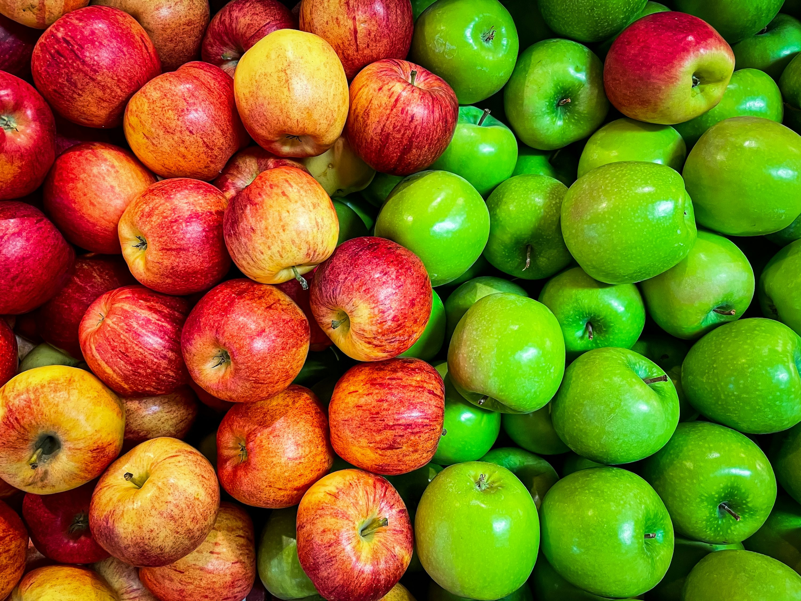
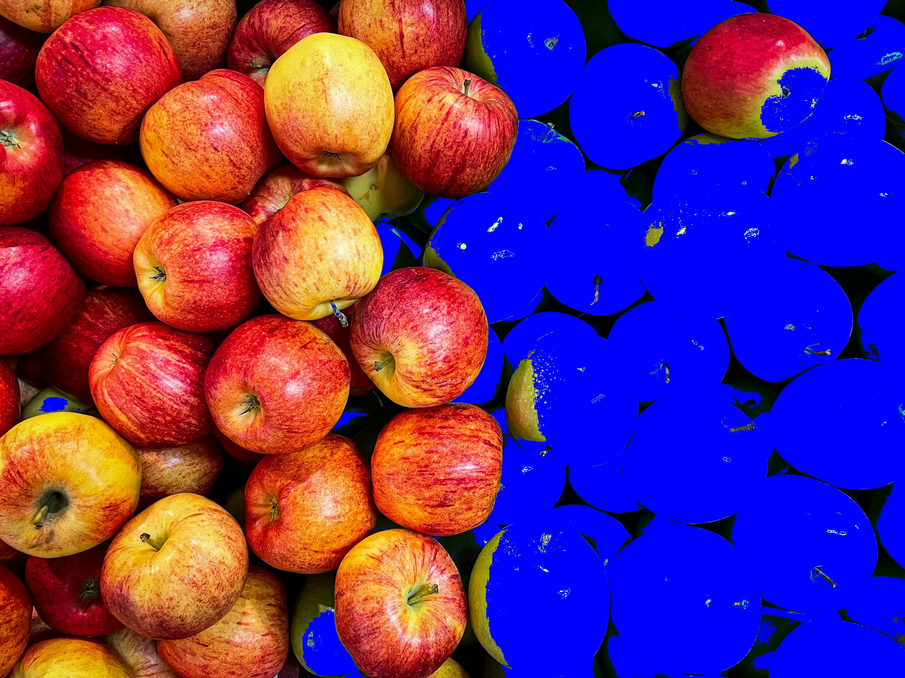

# Processamento de Imagens

O projeto consiste em um algoritmo para colorir os pixels de uma imagem tendo como base um banco de imagens padrão, no qual o método utilizado para cálculo das faixas de valores de referência é por meio da média e desvio padrão dos canais R, G, B.

Imagem original            |  Imagem processada
:-------------------------:|:-------------------------:
  |  

**IFSULDEMINAS - Câmpus Muzambinho**  
**Curso:** Ciência da Computação  
**Disciplina:** Computação Gráfica  
**Docente:** João Marcelo Ribeiro  

# Instruções para execução do projeto

## Passos para baixar e abrir o projeto

### 1. Baixe o arquivo *.zip* ou faça um *git clone* do repositório.

### 2. Após clonar o repositório ou extrair o conteúdo do arquivo *.zip*, abra a pasta do projeto utilizando um editor de código de sua preferência.

### 3. Com a pasta aberta no editor, crie ou acesse um terminal existente e siga os passos da seção abaixo.

## Passos para instalar as dependências e rodar o projeto

### 1. Crie um ambiente virtual:
```bash
python -m venv venv
```
### 2. Ative o ambiente virtual:
#### Windows: 
```
.\venv\Scripts\activate
```
#### MacOS/Linux:
```
source venv/bin/activate
```
### 3. Instale as dependências:
```bash
pip install -r requirements.txt
```
### 4. Execute o projeto:
```bash
python processor.py
```

### **OBS:** Caso esteja enfrentando problemas de execução devido às bibliotecas importadas no código não estarem sendo reconhecidas, certifique-se de que o interpretador Python seja o do ambiente virtual.
